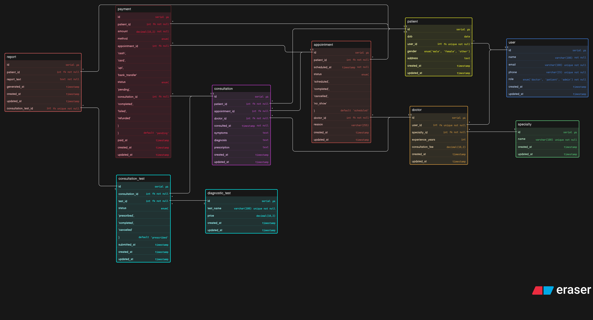

# Clinic-Appointment-and-Diagnostics-Platform-DB-Design

---

# Mental Map

## 1. Patient Registers in System

Patient account/profile is created.

Stored in:
* `patient`

Stored data:

* name
* email
* phone
* gender
* date of birth
* address

---

## 2. Doctor Setup

Doctor profile is created and linked to specialty.

Stored in:

* `user`
* `doctor`
* `specialty`

Stored data:

* doctor name
* specialty
* consultation fee
* experience

---

## 3. Patient Books Appointment

Patient selects doctor and date/time (what type of doctor for specialty)

Stored in `appointment`

Stored data:

* patient_id
* doctor_id
* scheduled_at
* reason
* status = scheduled

---

## 4. Appointment Day

Possible outcomes:

### If Patient Arrives

Appointment may become actual visit.

### If Patient Does Not Come

Update status to `no_show`

### If Cancelled

Update status to `cancelled`

---

## 5. Consultation / Actual Visit

When doctor sees patient, create row in `consultation`.

Stored data:

* appointment_id (optional for walk-in)
* patient_id
* doctor_id
* consulted_at
* symptoms
* diagnosis
* prescription

---

## 6. Walk-In Patient Case

If patient comes without booking:

Create consultation directly with `appointment_id = null`

This supports real clinic workflow.

---

## 7. Doctor Prescribes Diagnostic Tests

One consultation can have multiple tests.

Create rows in:

* `consultation_test`

Linked with:

* `diagnostic_test`

Stored data:

* consultation_id
* test_id
* status = prescribed

Examples:

* Blood Test
* X-Ray
* ECG
* Sugar Test

---

## 8. Test Processing

When sample collected or test completed:

Update `consultation_test`

Possible statuses:

* prescribed
* completed
* cancelled

---

## 9. Report Generation

After test completion, create row in `report`.

Stored data:

* consultation_test_id
* patient_id
* report_text
* generated_at

Each prescribed test can generate one report.

---

## 10. Payment Flow

Payment can happen:

### During Booking

Linked to appointment.

### After Consultation

Linked to consultation.

Stored in `payment`

Stored data:

* patient_id
* amount
* method
* status
* paid_at

---

# Daily Business Flow

Patient → Appointment → Consultation → Tests → Report → Payment

---

# While Clinic Is Running

## Appointment State

Stored in `appointment.status`

Examples:

* scheduled
* completed
* cancelled
* no_show

## Consultation Records

Stored in `consultation`

Tracks all doctor visits.

## Test Status

Stored in `consultation_test.status`

Examples:

* prescribed
* completed
* cancelled

## Payment Status

Stored in `payment.status`

Examples:

* pending
* completed
* failed
* refunded

---

## Real Example

Rahul books appointment with Skin Specialist for Monday 10 AM.

Flow:

1. Appointment created
2. Rahul visits clinic
3. Consultation created
4. Doctor diagnoses allergy
5. Doctor prescribes Blood Test
6. Test completed later
7. Report generated
8. Payment completed

---

# Key Tables

* `user`
* `patient`
* `doctor`
* `specialty`
* `appointment`
* `consultation`
* `diagnostic_test`
* `consultation_test`
* `report`
* `payment`

---
